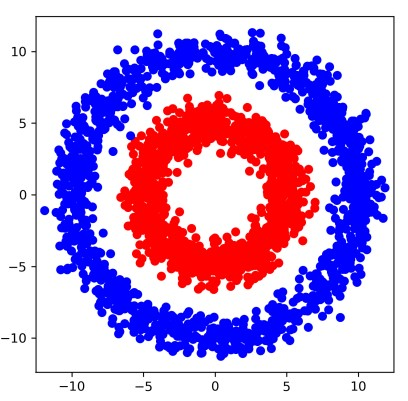
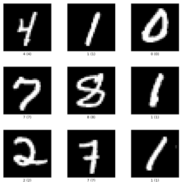

# Project 1 - 2D and Mnist Classifiers using Pytorch

## 1 - Environment Setup

The virtual environment containing modules for this project can be activated using conda (or miniconda).
Once you open the conda terminal, move to the root of the code directory to install and activate the 
environment.
```BASH
conda env create -f env.yml
conda activate cv-intro-to-pytorch
```

## 2 - Simple 2D Classifier
The first part of the project is training a simple binary classifier on the 2D data visualized in the Figure below. 
In the image, red points are part of cluster 0, and blue points part of cluster 1. For this section, you will work on the
code present in the simple-2D-classifier directory.



## 3 - Digit Classifier using Mnist Dataset
Next task is handwritten digit classification. Some examples are visualized in the figure below. Images in this dataset
are 28x28 pixels. There are 10 classes; one per digit from 0 to 9.



Source: [Mnist Dataset](https://www.tensorflow.org/datasets/catalog/mnist)


